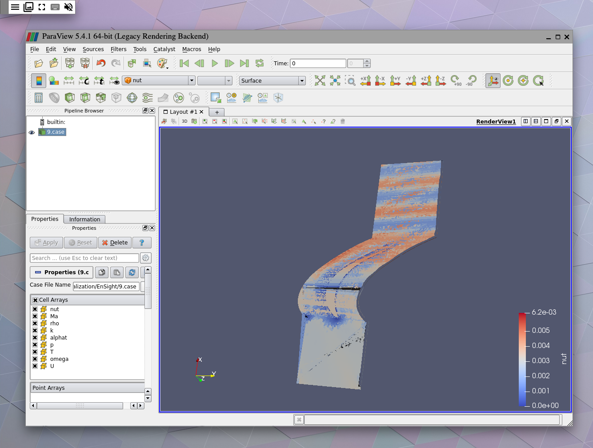

# OpenFOAM Template

Template of a LEXIS workflow allowing to perform Computational Fluid Dynamics simulations,
and visualize results.

The Run workflow is doing:
* the transfer of an input dataset from DDI to a HEAppE job.
* the submission of this HEAppE job and the monitoring of its execution
* the staging of HEAppE job results to DDI
* the transfer of HEAppE job results on a Cloud Compute instance 
* the installation and run of [Xpra](https://xpra.org/) remote display along with [ParaView](https://www.paraview.org/)
* the cleanup of resources once the session has expired or was closed by the user

## Input properties

The template expects the following input properties (mandatory inputs in **bold**):
*  **token**: OpenID Connect access token
* **project_id**: LEXIS project identifier
* **preprocessing_dataset_input_path**: Input dataset path in DDI
* **computation_title_dataset_result**: Title of the result dataset to create in DDI
* **computation_ddi_project_path**: Path of the project where to transfer the computation results in DDI: project/projxxx
* **visualization_walltime_minutes**: Duration in minutes of the visualization session
* preprocessing_decrypt_input_dataset: Should the input dataset be decrypted (default: false)
* preprocessing_uncompress_input_dataset: Should the input dataset be uncompressed (default: false)
* computation_encrypt_dataset_result: Should the result dataset be encrypted (default: false)
* computation_compress_dataset_result: Should the result dataset be compressed (default: false)
* visualization_directory: Directory where visualization data will be accesible on a cloud instance (default: openfoam)
* visualization_ca_pem: PEM-encoded certificate authority content. Will be generated if not provided,
but the user will get a warning that he attempts to connect to a server with an invalid certificate authority (as unknown certificate issuer)
* visualization_ca_key: Certificate authority private key content, will be generated if not provided
* visualization_ca_passphrase: Certificate authority private key passphrase
* visualization_port: Port to use to expose the remote display, should be > 1024 (default: 8765)

## Ouput attributes

The following output attributes are provided:
* attribute `url` of component `XpraJob`: the URL of the remote visualization session
* attribute `destination_path` of component `HPCToDDIJob` : The OpenFOAM results dataset path in DDI 

# Access to the remote session

Once the `XpraJob` job is running, the remote session URL is available in the Application outputs in Alien4Cloud.
Click on it and you will get an access to the remote session with Paraview running.
Select `File`> `Open` in Paraview, and select the data to visualize in the home directory `openfoam` (by default),
sub-directory `EnSight`, and select file `*.case`.
Once the file is loaded, click on `Apply` in the `Properties` pane on the left hand side to visualize you data:

## Ending the workflow

The remote display session will automatically be stopped atfer the duration 
provided in input property **visualization_walltime_minutes** is elapsed.

But the use can end the session himself clicking on the top left menu of Xpra
and selecting `Server` > `Shutdown Server` and the workflow will then continue with a cleanup step
to release the Cloud compute instance:

